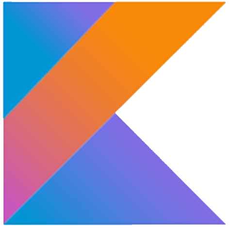
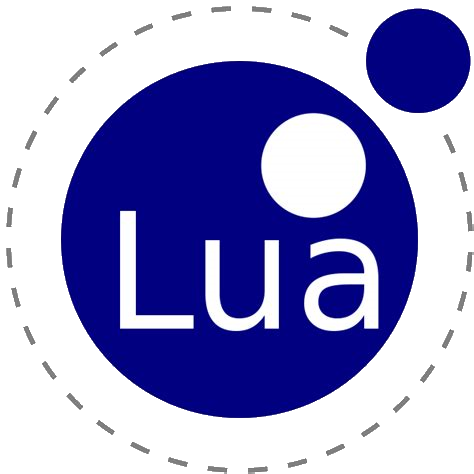
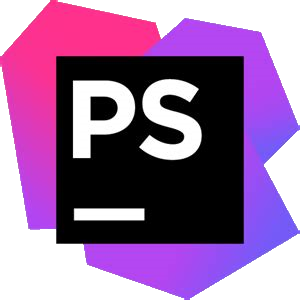

## About Me
Hello im Valo. \
I enjoy programming video games (or messing around with games) and learning something new.

## Projects im currently working on
- Custom Board Website
- [BoltOS](https://github.com/bolt-sys)

## My Languages and IDEs

### My Programming Languages 
 

 

### Software i use often

 
